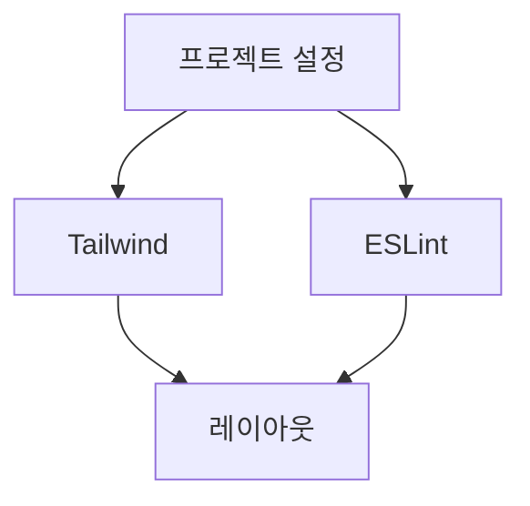

# TASKS Skill

PRD/TRD를 기반으로 실제 구현 가능한 태스크 목록으로 분해하는 워크플로우.

## 핵심 원칙

**실행 가능한 단위로 작업을 분해한다.** 각 태스크는 명확한 완료 조건과 예상 범위를 가져야 한다.

## TASKS 작성 프로세스

### Phase 1: 작업 분해

1. PRD의 기능 요구사항을 Epic 단위로 분류
2. 각 Epic을 구현 가능한 Story로 분해
3. 각 Story를 실제 코딩 Task로 세분화

### Phase 2: 의존성 분석

1. "이 태스크를 시작하기 전에 완료되어야 하는 것은?"
2. "병렬로 진행 가능한 태스크는?"
3. "블로킹 의존성이 있는 태스크는?"

### Phase 3: 우선순위 결정

1. MVP에 필수인 태스크 식별
2. 기술적 의존성 기반 순서 결정
3. 리스크가 높은 태스크 우선 배치

### Phase 4: 검증 기준 정의

1. 각 태스크의 완료 조건(Definition of Done)
2. 테스트 요구사항
3. 리뷰 체크포인트

## 태스크 분해 규칙

- 하나의 태스크는 하나의 책임만 갖는다
- 태스크는 독립적으로 테스트 가능해야 한다
- 너무 크면 분할, 너무 작으면 병합
- 모호한 태스크는 구체화한다

## 태스크 크기 가이드

| 크기 | 설명 | 예시 |
|------|------|------|
| XS | 설정/환경 변경 | 환경변수 추가, 패키지 설치 |
| S | 단일 함수/컴포넌트 | 유틸 함수 작성, 버튼 컴포넌트 |
| M | 기능 단위 | API 엔드포인트, 폼 컴포넌트 |
| L | 모듈 단위 | 인증 시스템, 결제 연동 |
| XL | 분할 필요 | 너무 큼 - 분할해야 함 |

## TASKS 출력 형식

```markdown
# [제품명] TASKS

## 문서 정보
- PRD 참조: [PRD 링크]
- TRD 참조: [TRD 링크]
- 작성일:
- 마지막 수정:

---

## Epic 1: [Epic 명]

### Story 1.1: [Story 명]
> As a [사용자], I want to [행동], so that [가치]

#### Tasks

| ID | Task | 크기 | 의존성 | 상태 |
|----|------|------|--------|------|
| T1.1.1 | 프로젝트 초기 설정 (Vite + React + TS) | S | - | [ ] |
| T1.1.2 | Tailwind CSS 설정 | XS | T1.1.1 | [ ] |
| T1.1.3 | ESLint + Prettier 설정 | XS | T1.1.1 | [ ] |

#### 완료 조건
- [ ] 개발 서버 정상 실행
- [ ] 타입 체크 통과
- [ ] 린트 에러 없음

---

### Story 1.2: [Story 명]
...

---

## Epic 2: [Epic 명]

### Story 2.1: [Story 명]
...

---

## 마일스톤

### M1: MVP 완료
- [ ] Epic 1 완료
- [ ] Epic 2 완료
- 목표:

### M2: Phase 2 완료
- [ ] Epic 3 완료
- 목표:

---

## 의존성 그래프



---

## 리스크 태스크

높은 불확실성 또는 기술적 도전이 있는 태스크:

| ID | Task | 리스크 | 완화 방안 |
|----|------|--------|-----------|
| T3.2.1 | 결제 시스템 연동 | 외부 API 의존 | 목업 API로 선개발 |
| ... | ... | ... | ... |

---

## 진행 현황

### 통계
- 전체 태스크: 45개
- 완료: 12개 (27%)
- 진행 중: 3개
- 대기: 30개

### 최근 완료
- [x] T1.1.1 프로젝트 초기 설정
- [x] T1.1.2 Tailwind CSS 설정
```

## 워크플로우 예시

```
사용자: "쇼핑몰 TASKS 작성해줘"

Claude: "PRD와 TRD 기반으로 태스크를 분해하겠습니다.

먼저 주요 Epic을 식별했습니다:
1. 프로젝트 초기 설정
2. 사용자 인증
3. 상품 관리
4. 장바구니/주문
5. 결제 연동

1. 어떤 Epic부터 시작할까요?
2. 특별히 우선순위가 높은 기능이 있나요?"

사용자: "인증부터 시작하고 싶어요"

Claude: "인증 Epic을 상세 분해하겠습니다.

**Epic 2: 사용자 인증**

Story 2.1: 회원가입
- T2.1.1 회원가입 API 엔드포인트 (M)
- T2.1.2 이메일 중복 체크 API (S)
- T2.1.3 회원가입 폼 컴포넌트 (M)
- T2.1.4 입력 유효성 검증 (S)
- T2.1.5 회원가입 성공/실패 처리 (S)

Story 2.2: 로그인
- T2.2.1 로그인 API 엔드포인트 (M)
- T2.2.2 JWT 토큰 발급 로직 (M)
- T2.2.3 로그인 폼 컴포넌트 (S)
- T2.2.4 토큰 저장 및 자동 로그인 (S)

이 분해가 적절한가요? 수정이 필요한 부분이 있나요?"

... (검토 및 조정) ...
```

## 태스크 상태 관리

| 상태 | 표기 | 설명 |
|------|------|------|
| 대기 | `[ ]` | 아직 시작하지 않음 |
| 진행 중 | `[~]` | 현재 작업 중 |
| 완료 | `[x]` | 완료됨 |
| 블록 | `[!]` | 의존성으로 인해 대기 |
| 취소 | `[-]` | 더 이상 필요 없음 |

## TASKS 완료 후

TASKS 확정 후 다음 단계 제안:

1. "첫 번째 태스크부터 구현을 시작할까요?"
2. "특정 태스크에 대해 더 상세한 계획이 필요한가요?"
3. "스프린트 계획을 세울까요?"

## 구현 시 태스크 활용

```
사용자: "T2.1.1 구현해줘"

Claude: "T2.1.1 회원가입 API 엔드포인트를 구현하겠습니다.

**태스크 정보**
- ID: T2.1.1
- 설명: 회원가입 API 엔드포인트
- 크기: M
- 의존성: T1.1.1 (프로젝트 설정) ✅

**구현 계획**
1. User 모델/스키마 정의
2. POST /api/v1/auth/register 엔드포인트 생성
3. 입력 검증 미들웨어 추가
4. 비밀번호 해싱 적용
5. 응답 형식 통일

구현을 시작할까요?"
```

## PRD → TRD → TASKS 연결

```
PRD                    TRD                     TASKS
────────────────────────────────────────────────────────
F001: 회원가입    →   API: POST /auth/register  →  T2.1.1~T2.1.5
                      DB: users 테이블
                      보안: bcrypt 해싱

F002: 로그인      →   API: POST /auth/login     →  T2.2.1~T2.2.4
                      인증: JWT
                      저장: Redis 세션
```
